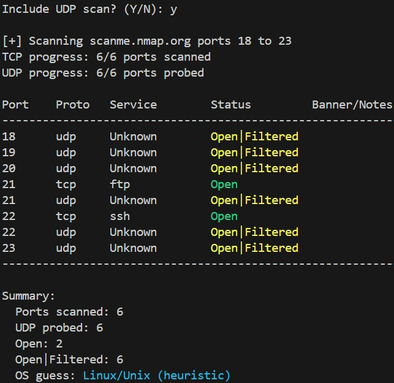

# 🔎 Port Scanner

---

## OVERVIEW

A minimal, beginner-friendly **multi-threaded port scanner** written in Python. It scans a user-specified port range on a target host, performs TCP banner grabbing, optional UDP probing, and displays **only open ports** in a tidy table. The project includes a simple heuristic OS detection (based on open ports and banner keywords) and is designed to be easy to read and modify for internship/demo use.

---

## OBJECTIVE

* Teach basic network scanning concepts (TCP/UDP, sockets, timeouts, concurrency).
* Provide a compact, practical tool that finds open ports and collects simple service banners.
* Produce readable output suitable for reports or portfolio demos.

---

## SCRIPT FEATURES

* TCP connect-based port scanning (reuses connected socket for banner grabbing).
* Optional UDP probing (marks `Open` or `Open|Filtered` where replies are absent).
* Shows **only open ports** in the final table with columns: Port, Proto, Service, Status, Banner/Notes.
* Simple heuristic OS detection (`Windows`, `Linux/Unix`, `Network Device`, `Unknown`).
* Multi-threading using `ThreadPoolExecutor` for faster scans (configurable worker counts).
* Safe defaults for timeouts and concurrency, with easy variables to tune.
* Clear, minimal code for beginners — well-commented and easy to extend.

---

## ⚙️ Requirements

* Python 3.7 or newer
* No external libraries required (uses Python Standard Library only):

  * `socket`, `sys`, `concurrent.futures`, `datetime`

---

## 📂 Project Structure

```
port_scanner/
├── port_scanner.py   # Main script (TCP + UDP)
├── Readme.md            # This file
└── docs/               # PDF & img files
```

---

## ▶️ Usage (Run Overview)

Run the script with Python :

```bash
python port_scanner.py
```
Follow prompts:

* **Enter target IP or hostname** (e.g., `127.0.0.1` or `scanme.nmap.org`).
* **Enter start port** and **end port** (e.g., `1` and `1024`).
* **Include UDP scan? (Y/N)** — optional; UDP probes are slower and less certain.


---

## ℹ️ Notes & tips

* **Permission:** Only scan systems you own or have explicit permission to scan. Unauthorized scanning can be illegal.
* **Timeouts & Reliability:** Default connect timeout is short (1s). If you scan remote or slow hosts, increase `settimeout()` values to 2–3 seconds.
* **Worker count:** Default `max_workers=100` for TCP; if you see `OSError: [Errno 24] Too many open files`, lower this to 50 or less.
* **UDP behavior:** UDP often replies silently. The script marks non-replies as `Open|Filtered` — this is normal.
* **Banners:** Not all services send banners. HTTP responses are probed with a simple `GET` to coax a response; other protocols may need custom probes.
* **Improving OS detection:** This script uses heuristics. For accurate OS fingerprinting use specialized tools like `nmap` or `p0f`.

---

## 🔐 Use Case

* **Learning & practice:** Great for beginners learning sockets, concurrency, and basic reconnaissance techniques.
* **Home lab testing:** Scan VMs or devices in your own lab to catalogue open services.
* **Internship/demo:** Include the tool in a submission to demonstrate practical scripting, documentation, and safe scanning practices.

---

## Example output (short)

```
=== Port Scanner ===
Enter target IP or hostname: scanme.nmap.org
Enter start port (e.g. 1): 1
Enter end port (e.g. 1024): 1000
Include UDP scan? (Y/N): n

[+] Scanning scanme.nmap.org ports 1 to 1000
TCP progress: 1000/1000 ports scanned

Port    Proto   Service        Status         Banner/Notes
----------------------------------------------------------------------------------------------------
21      tcp     ftp            Open  
22      tcp     ssh            Open  
80      tcp     http           Open  HTTP/1.1 200 OK
554     tcp     rtsp           Open
----------------------------------------------------------------------------------------------------

Summary:
  Ports scanned: 1000
  Open: 4
  Open|Filtered: 0
  OS guess: Linux/Unix (heuristic)

[+] Scan completed in: 0:00:10.202131

```

---

